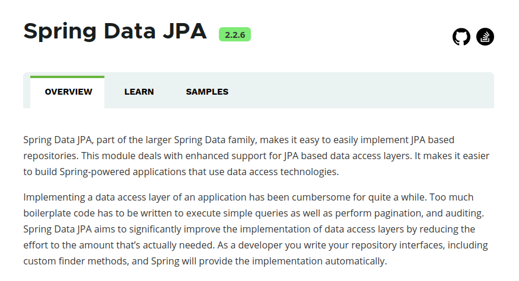
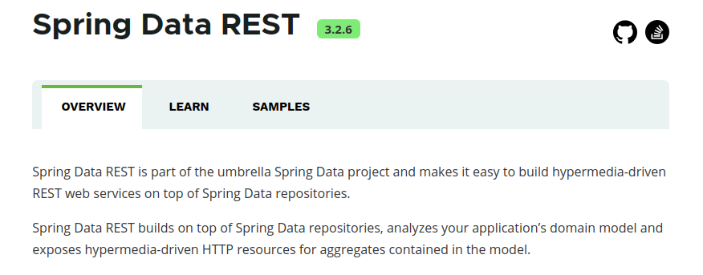

Spring Data JPA Example
---
# JPA是什么
JPA （Java Persistence API）Java持久化API。是一套Sun公司Java官方制定的ORM 方案,是规范，是标准 ，sun公司自己并没有实现。

# ORM是什么
ORM（Object Relational Mapping）对象关系映射。

# JPA的实现者
既然我们说JPA是一套标准，意味着，它只是一套实现ORM理论的接口。没有实现的代码。
市场上的主流的JPA框架（实现者）有： 
Hibernate（JBoos）、EclipseLink（Eclipse社区）、OpenJPA（Apache基金会）。
 
# Spring Data JPA

来看一下Spring官方的解释： https://spring.io/projects/spring-data-jpa#overview



Spring Data JPA是Spring Data家族的一部分，可以轻松实现基于JPA的存储库。 此模块处理对基于JPA的数据访问层的增强支持。
它使构建使用数据访问技术的Spring驱动应用程序变得更加容易。

在相当长的一段时间内，实现应用程序的数据访问层一直很麻烦。 必须编写太多样板代码来执行简单查询以及执行分页和审计。 
Spring Data JPA旨在通过减少实际需要的工作量来显著改善数据访问层的实现。 作为开发人员，您编写repository接口，包括自定义查找器方法，Spring将自动提供实现。

总的来说JPA是ORM规范，Hibernate、TopLink等是JPA规范的具体实现，这样的好处是开发者可以面向JPA规范进行持久层的开发，而底层的实现则是可以切换的。Spring Data Jpa则是在JPA之上添加另一层抽象（Repository层的实现），极大地简化持久层开发及ORM框架切换的成本。

## 快速入门

在Spring-Boot中加入依赖：

```xml
<dependencies>
  <dependency>
    <groupId>org.springframework.data</groupId>
    <artifactId>spring-data-jpa</artifactId>
  </dependency>
<dependencies>
```
在application.propertie中加入数据源配置：
```properties
# 数据源配置
spring.datasource.driver-class-name=com.mysql.cj.jdbc.Driver
spring.datasource.url=jdbc:mysql://wetech.tech:3306/example
spring.datasource.username=example
spring.datasource.password=rjtJmEz3r5BEw3j3
```
新建实体
```java
@Entity
public class Book {
@Id
private Long id;
@Column(name = "name")
private String name;
// 以下省略...
}
```
新建Repository
```java
public interface BookRepository extends Repository<Book, Long> {
    // 关键字方法名查询
    Book findDistinctFirstByName(String name);
    // Query注解查询
    @Query(value = "from Book b where b.name like %:name%")
    List<Book> findByNameMatch(@Param("name") String name);
}
```


## @Query注解的用法(Spring Data JPA)

1. 一个使用@Query注解的简单例子

```java
@Query(value = "from Book b where b.price>:price1 and b.price<:price2")
List<Book> findByPriceRange(long price1, long price2);
```

2.  Like表达式

```java
@Query(value = "from Book b where b.name like %:name%")
List<Book> findByNameMatch(@Param("name") String name);
```

3. 使用Native SQL Query

所谓本地查询，就是使用原生的sql语句（根据数据库的不同，在sql的语法或结构方面可能有所区别）进行查询数据库的操作。
```java
@Query(value = "select * from book b where b.name=?1", nativeQuery = true)
List<Book> findByName(String name);
```

4. 使用@Param注解注入参数
```java
@Query(value = "from Book b where b.name = :name AND b.author=:author AND b.price=:price")
List<Book> findByNamedParam(@Param("name") String name, @Param("author") String author, @Param("price") long price);
```

5. SPEL表达式(使用时请参考最后的补充说明)

   '#{#entityName}'值为'Book'对象对应的数据表名称(book)。
```java
public interface BookQueryRepositoryExample extends Repository<Book, Long>{
       @Query(value = "select * from #{#entityName} b where b.name=?1", nativeQuery = true)
       List<Book> findByName(String name);
}
```
6. 一个较完整的例子
```java
public interface BookRepository extends Repository<Book, Long> {
    @Query(value = "select * from Book b where b.name=?1", nativeQuery = true) 
    List<Book> findByName(String name);// 此方法将会报错(java.lang.IllegalArgumentException)，

    @Query(value = "from Book b where b.price>?1 and b.price<?2")
    List<Book> findByPriceRange(long price1, long price2);

    @Query(value = "from Book b where b.name like %:name%")
    List<Book> findByNameMatch(@Param("name") String name);

    @Query(value = "select new Book(name,author,price) from Book b where b.name = :name AND b.author=:author AND b.price=:price")
    List<Book> findByNamedParam(@Param("name") String name, @Param("author") String author,
            @Param("price") long price);//查询指定的字段
}
```

## JPQL(JPA的查询语句)

JPQL全称Java Persistence Query Language。

基于首次在EJB2.0中引入的EJB查询语言(EJB QL),Java持久化查询语言(JPQL)是一种可移植的查询语言，旨在以面向对象表达式语言的表达式，将SQL语法和简单查询语义绑定在一起·使用这种语言编写的查询是可移植的，可以被编译成所有**主流数据库服务器**上的SQL。
其特征与原生SQL语句类似，并且完全面向对象，通过类名和属性访问，而不是表名和表的属性。

详细可以自行百度了解： https://baike.baidu.com/item/JPQL/282359?fr=aladdin

## 关键字方法名查询(Spring Data JPA)

Spring Data JPA 中我们经常会对数据库进行各种各样的CURD操作。比如，查询操作。

当然对于一些简单业务的CURD操作由jpa自带的JpaRepository接口就行已经可以满足了，但是往往在开发中需求的复杂程度是不能够预测的，所以构建一些能自适应相对复杂业务的CURD操作是很有必要的。

这时候我们也可以选择采用@Query注解进行原生SQL语句的编写、获取采用@Query注解编写SpEL语句进行着对数据库的CURD操作。

而现在我要说的是采用jpa 提供的方法名派生查询的方式。比如在Person类中有lastName属性，就可以构造一个这样的查询方法：findPersonByLastName(String lastName)。

意思是根据lastName属性值查询响应的Person对象，而Person类映射着数据表，自然而然地形成了间接起到了查询数据表的操作。

当然前提是Person的持久化接口先继承了jpa的持久化接口JpaRepository。下面是方法名派生查询中能用到的关键字：
<table class="tableblock frame-all grid-all fit-content">
<caption class="title">Table 3. Supported keywords inside method names</caption>
<colgroup>
<col>
<col>
<col>
</colgroup>
<thead>
<tr>
<th class="tableblock halign-left valign-top">Keyword</th>
<th class="tableblock halign-left valign-top">Sample</th>
<th class="tableblock halign-left valign-top">JPQL snippet</th>
</tr>
</thead>
<tbody>
<tr>
<td class="tableblock halign-left valign-top"><p class="tableblock"><code>And</code></p></td>
<td class="tableblock halign-left valign-top"><p class="tableblock"><code>findByLastnameAndFirstname</code></p></td>
<td class="tableblock halign-left valign-top"><p class="tableblock"><code>… where x.lastname = ?1 and x.firstname = ?2</code></p></td>
</tr>
<tr>
<td class="tableblock halign-left valign-top"><p class="tableblock"><code>Or</code></p></td>
<td class="tableblock halign-left valign-top"><p class="tableblock"><code>findByLastnameOrFirstname</code></p></td>
<td class="tableblock halign-left valign-top"><p class="tableblock"><code>… where x.lastname = ?1 or x.firstname = ?2</code></p></td>
</tr>
<tr>
<td class="tableblock halign-left valign-top"><p class="tableblock"><code>Is</code>, <code>Equals</code></p></td>
<td class="tableblock halign-left valign-top"><p class="tableblock"><code>findByFirstname</code>,<code>findByFirstnameIs</code>,<code>findByFirstnameEquals</code></p></td>
<td class="tableblock halign-left valign-top"><p class="tableblock"><code>… where x.firstname = ?1</code></p></td>
</tr>
<tr>
<td class="tableblock halign-left valign-top"><p class="tableblock"><code>Between</code></p></td>
<td class="tableblock halign-left valign-top"><p class="tableblock"><code>findByStartDateBetween</code></p></td>
<td class="tableblock halign-left valign-top"><p class="tableblock"><code>… where x.startDate between ?1 and ?2</code></p></td>
</tr>
<tr>
<td class="tableblock halign-left valign-top"><p class="tableblock"><code>LessThan</code></p></td>
<td class="tableblock halign-left valign-top"><p class="tableblock"><code>findByAgeLessThan</code></p></td>
<td class="tableblock halign-left valign-top"><p class="tableblock"><code>… where x.age &lt; ?1</code></p></td>
</tr>
<tr>
<td class="tableblock halign-left valign-top"><p class="tableblock"><code>LessThanEqual</code></p></td>
<td class="tableblock halign-left valign-top"><p class="tableblock"><code>findByAgeLessThanEqual</code></p></td>
<td class="tableblock halign-left valign-top"><p class="tableblock"><code>… where x.age &lt;= ?1</code></p></td>
</tr>
<tr>
<td class="tableblock halign-left valign-top"><p class="tableblock"><code>GreaterThan</code></p></td>
<td class="tableblock halign-left valign-top"><p class="tableblock"><code>findByAgeGreaterThan</code></p></td>
<td class="tableblock halign-left valign-top"><p class="tableblock"><code>… where x.age &gt; ?1</code></p></td>
</tr>
<tr>
<td class="tableblock halign-left valign-top"><p class="tableblock"><code>GreaterThanEqual</code></p></td>
<td class="tableblock halign-left valign-top"><p class="tableblock"><code>findByAgeGreaterThanEqual</code></p></td>
<td class="tableblock halign-left valign-top"><p class="tableblock"><code>… where x.age &gt;= ?1</code></p></td>
</tr>
<tr>
<td class="tableblock halign-left valign-top"><p class="tableblock"><code>After</code></p></td>
<td class="tableblock halign-left valign-top"><p class="tableblock"><code>findByStartDateAfter</code></p></td>
<td class="tableblock halign-left valign-top"><p class="tableblock"><code>… where x.startDate &gt; ?1</code></p></td>
</tr>
<tr>
<td class="tableblock halign-left valign-top"><p class="tableblock"><code>Before</code></p></td>
<td class="tableblock halign-left valign-top"><p class="tableblock"><code>findByStartDateBefore</code></p></td>
<td class="tableblock halign-left valign-top"><p class="tableblock"><code>… where x.startDate &lt; ?1</code></p></td>
</tr>
<tr>
<td class="tableblock halign-left valign-top"><p class="tableblock"><code>IsNull</code>, <code>Null</code></p></td>
<td class="tableblock halign-left valign-top"><p class="tableblock"><code>findByAge(Is)Null</code></p></td>
<td class="tableblock halign-left valign-top"><p class="tableblock"><code>… where x.age is null</code></p></td>
</tr>
<tr>
<td class="tableblock halign-left valign-top"><p class="tableblock"><code>IsNotNull</code>, <code>NotNull</code></p></td>
<td class="tableblock halign-left valign-top"><p class="tableblock"><code>findByAge(Is)NotNull</code></p></td>
<td class="tableblock halign-left valign-top"><p class="tableblock"><code>… where x.age not null</code></p></td>
</tr>
<tr>
<td class="tableblock halign-left valign-top"><p class="tableblock"><code>Like</code></p></td>
<td class="tableblock halign-left valign-top"><p class="tableblock"><code>findByFirstnameLike</code></p></td>
<td class="tableblock halign-left valign-top"><p class="tableblock"><code>… where x.firstname like ?1</code></p></td>
</tr>
<tr>
<td class="tableblock halign-left valign-top"><p class="tableblock"><code>NotLike</code></p></td>
<td class="tableblock halign-left valign-top"><p class="tableblock"><code>findByFirstnameNotLike</code></p></td>
<td class="tableblock halign-left valign-top"><p class="tableblock"><code>… where x.firstname not like ?1</code></p></td>
</tr>
<tr>
<td class="tableblock halign-left valign-top"><p class="tableblock"><code>StartingWith</code></p></td>
<td class="tableblock halign-left valign-top"><p class="tableblock"><code>findByFirstnameStartingWith</code></p></td>
<td class="tableblock halign-left valign-top"><p class="tableblock"><code>… where x.firstname like ?1</code> (parameter bound with appended <code>%</code>)</p></td>
</tr>
<tr>
<td class="tableblock halign-left valign-top"><p class="tableblock"><code>EndingWith</code></p></td>
<td class="tableblock halign-left valign-top"><p class="tableblock"><code>findByFirstnameEndingWith</code></p></td>
<td class="tableblock halign-left valign-top"><p class="tableblock"><code>… where x.firstname like ?1</code> (parameter bound with prepended <code>%</code>)</p></td>
</tr>
<tr>
<td class="tableblock halign-left valign-top"><p class="tableblock"><code>Containing</code></p></td>
<td class="tableblock halign-left valign-top"><p class="tableblock"><code>findByFirstnameContaining</code></p></td>
<td class="tableblock halign-left valign-top"><p class="tableblock"><code>… where x.firstname like ?1</code> (parameter bound wrapped in <code>%</code>)</p></td>
</tr>
<tr>
<td class="tableblock halign-left valign-top"><p class="tableblock"><code>OrderBy</code></p></td>
<td class="tableblock halign-left valign-top"><p class="tableblock"><code>findByAgeOrderByLastnameDesc</code></p></td>
<td class="tableblock halign-left valign-top"><p class="tableblock"><code>… where x.age = ?1 order by x.lastname desc</code></p></td>
</tr>
<tr>
<td class="tableblock halign-left valign-top"><p class="tableblock"><code>Not</code></p></td>
<td class="tableblock halign-left valign-top"><p class="tableblock"><code>findByLastnameNot</code></p></td>
<td class="tableblock halign-left valign-top"><p class="tableblock"><code>… where x.lastname &lt;&gt; ?1</code></p></td>
</tr>
<tr>
<td class="tableblock halign-left valign-top"><p class="tableblock"><code>In</code></p></td>
<td class="tableblock halign-left valign-top"><p class="tableblock"><code>findByAgeIn(Collection&lt;Age&gt; ages)</code></p></td>
<td class="tableblock halign-left valign-top"><p class="tableblock"><code>… where x.age in ?1</code></p></td>
</tr>
<tr>
<td class="tableblock halign-left valign-top"><p class="tableblock"><code>NotIn</code></p></td>
<td class="tableblock halign-left valign-top"><p class="tableblock"><code>findByAgeNotIn(Collection&lt;Age&gt; ages)</code></p></td>
<td class="tableblock halign-left valign-top"><p class="tableblock"><code>… where x.age not in ?1</code></p></td>
</tr>
<tr>
<td class="tableblock halign-left valign-top"><p class="tableblock"><code>True</code></p></td>
<td class="tableblock halign-left valign-top"><p class="tableblock"><code>findByActiveTrue()</code></p></td>
<td class="tableblock halign-left valign-top"><p class="tableblock"><code>… where x.active = true</code></p></td>
</tr>
<tr>
<td class="tableblock halign-left valign-top"><p class="tableblock"><code>False</code></p></td>
<td class="tableblock halign-left valign-top"><p class="tableblock"><code>findByActiveFalse()</code></p></td>
<td class="tableblock halign-left valign-top"><p class="tableblock"><code>… where x.active = false</code></p></td>
</tr>
<tr>
<td class="tableblock halign-left valign-top"><p class="tableblock"><code>IgnoreCase</code></p></td>
<td class="tableblock halign-left valign-top"><p class="tableblock"><code>findByFirstnameIgnoreCase</code></p></td>
<td class="tableblock halign-left valign-top"><p class="tableblock"><code>… where UPPER(x.firstame) = UPPER(?1)</code></p></td>
</tr>
</tbody>
</table>

## 扩展阅读

### Hibernate-VS-MyBatis
 
[Hibernate-VS-MyBatis.md](doc/Hibernate-VS-MyBatis.md "Hibernate-VS-MyBatis")

### Spring Data Rest



Spring Data REST 作为 Spring Data 项目的子集，开发者只需使用注解 @RepositoryRestResource 标记，就可以把整个 Repository 转换为 HAL 风格的 REST 资源。

目前已支持 Spring Data JPA、Spring Data MongoDB、Spring Data Neo4j等等。

https://www.jianshu.com/p/9293e6a78626