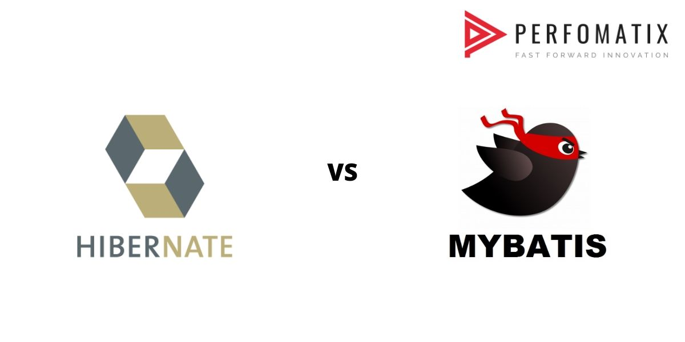
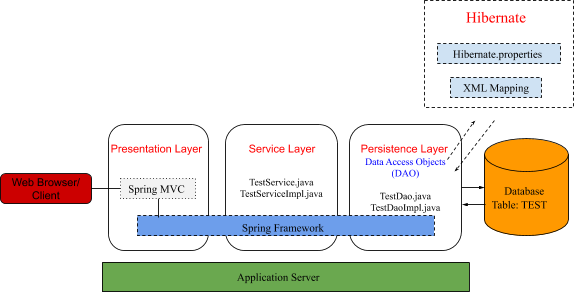
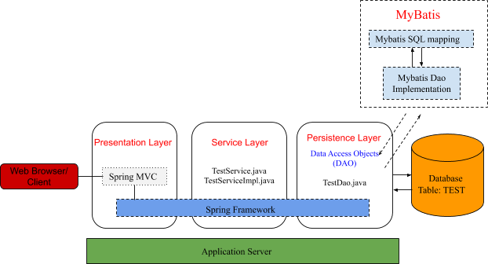

Hibernate vs MyBatis
---

在讨论Mybatis和Hibernate之前，最好先讨论 **对象关系映射** 概念。对象关系映射（ORM）是一种编程技术，它能够使用您首选的编程语言的面向对象范例来编写简单和复杂的查询（即在关系数据库和诸如Java，.NET之类的面向对象的编程语言之间转换数据等）。

对象关系映射（ORM）是一种从面向对象的语言访问关系数据库的技术（设计模式），可帮助您的应用程序实现持久化。那么持久化是什么？持久化只是意味着我们希望我们的应用程序的数据比应用程序的过程更长寿。用Java术语来说，某些对象的状态超出了JVM的范围，因此以后可以使用相同的状态。

Hibernate和MyBatis都与Spring框架兼容。Hibernate是一个对象关系映射框架（ORM），它将Java类映射到数据库表，而MyBatis是一个持久层框架不是ORM，它将SQL语句映射到Java方法上。

## 什么是Hibernate？

Hibernate是一个开源，轻量级的ORM（对象关系映射）工具。

它是一个Java框架，通过将应用程序域对象映射到关系数据库表，反之亦然，从而简化了Java应用程序的开发，从而可以与数据库进行交互，从而实现JPA（Java Persistence API）的数据持久化。

Hibernate通常使用自定义查询语言，即Hibernate查询语言（HQL）或Enterprise JavaBeans查询语言（EJB QL）。

Hibernate具有以下设计理念: 

**轻量级** - Hibernate是一个轻量级框架，因为它不包含其他功能。它仅使用对象关系映射所需的那些功能。

**开源** - Hibernate是开源软件，这意味着每个人都可以免费使用它。

**ORM（对象关系映射）**- Hibernate是一个ORM工具，可帮助Java类和关系数据库之间的交互。

**高性能** - Hibernate支持许多不同的获取技术，例如缓存，延迟初始化等，还可以实现高性能。

**HQL（Hibernate查询语言）**- Hibernate是轻量级框架，因为它不包含其他功能，并且仅使用对象关系映射所需的那些功能。

**缓存** - 缓存是将数据存储到缓存中并提高数据访问速度的过程。Hibernate支持两级缓存，第一级和第二级缓存。

**自动生成** - Hibernate提供了自动表生成的​​功能。这意味着程序员不必担心查询的实现，即Hibernate自己做。

**可扩展性** - Hibernate具有高度的可扩展性，因为它可以适应任何环境。Hibernate可用于小型和大型应用程序。

**延迟加载（懒加载）** - Hibernate支持一种称为延迟加载的新概念。延迟加载概念检索执行所需的唯一对象。它还可以提高应用程序的性能。

**数据库独立** - Hibernate提供了“数据库方言”，因此与数据库无关，因此我们无需编写SQL查询。它支持许多数据库，例如Oracle，MySql，Sybase等。

## 什么是Mybatis？

MyBatis是一个开源、轻量级的持久层框架。它是JDBC和Hibernate的替代方法。

它可以自动执行SQL数据库与Java，.NET等中的对象之间的映射。

MyBatis与其他持久性框架之间的显着区别是MyBatis强调使用SQL，而其他框架（例如Hibernate）通常使用自定义查询语言（HQL / EJB QL）。

MyBatis是iBATIS 3.0的一个分支，由包括iBATIS的原始创建者的团队维护。

MyBatis带有以下设计理念：

**开源** - MyBatis是免费的开源软件。

**支持ORM** – MyBatis支持许多与ORM工具相同的功能，例如延迟加载，联接获取，缓存，运行时代码生成和继承。

**简便性** - MyBatis被广泛认为是当今可用的最简单的持久层框架之一。

**快速开发** -  MyBatis竭尽所能促进超快速开发。

**可移植性** - MyBatis可以用于几乎任何语言或平台，例如Java，Ruby和Microsoft .NET的C＃。

**独立接口** - MyBatis提供了独立于数据库的接口，并且API可以帮助应用程序的其余部分保持独立于任何与持久性相关的资源。

**存储过程** - MyBatis以存储过程的形式封装SQL，以便可以将业务逻辑保留在数据库之外，并且应用程序更可移植，更易于部署和测试。

**内联SQL** - 不需要预编译器，您可以完全访问SQL的所有功能。

**动态SQL** - MyBatis提供了用于基于参数动态构建SQL查询的功能。

MyBatis以SQL为中心。它可以帮助您调用SQL语句并将结果（表）映射到对象树。主要好处是它不是ORM。它不会将表映射到对象，因此不会遭受ORM阻抗不匹配的情况。

## 在哪里使用Hibernate和MyBatis？

Hibernate用于：

- 常规CRUD（CREATE，READ，UPDATE和DELETE）功能。

- 该环境由对象模型驱动，需要自动生成SQL。

- 会话管理。

而MyBatis用于：

- 解析提取查询。

- 存储过程和动态SQL。

- 支持复杂的搜索查询（其中搜索条件是动态的）和结果分页。

## ORM与持久层框架

Hibernate是一个对象关系映射框架（ORM），它将Java类映射到数据库表。MyBatis是一个持久层框架–不是ORM。它将SQL语句映射到Java方法。

场景：

对于实例，请考虑要在其中更改领域数据的命令和要在其中仅获取某些数据的响应。

1. 创建/更新/删除一些复杂的领域实体

2. 运行分析获取查询（即求和/聚合查询）

Hibernate对于选择查询（情况1）效果很好，允许您只创建一个POJO并持久化/更新它。除非您的域很大，否则它也会快速执行此操作。

MyBatis非常适合您只需要答案的获取查询（案例2）。

Hibernate会尝试加载整个对象图，并且您需要使用惰性加载技巧来开始优化查询，以使其在较大的域中正常工作。

相反，如果只需要一些分析POJO页，则同一查询的MyBatis实现将是微不足道的。

因此，在SELECTS查询上，MyBatis 比Hibernate快。 

因此，考虑到这两种情况以及您的应用程序做什么，您可以得出结论，是否需要Hibernate或MyBatis。

如果您有一个简单的域并且仅获取信息，请使用MyBatis。如果您有一个复杂的域并保留了实体，请使用Hibernate。

如果两者都做，请考虑使用一种混合方法（即，成千上万个实体来控制它）。 

结论：

如上所述，如果您的应用以对象为中心，则Hibernate效果更好。

但是，如果您的应用以数据库为中心，那么MyBatis是一个更强大的选择。

两种工具的功能远不止上述，但是一个是ORM，一个不是。

翻译自：https://www.perfomatix.com/hibernate-vs-mybatis/

